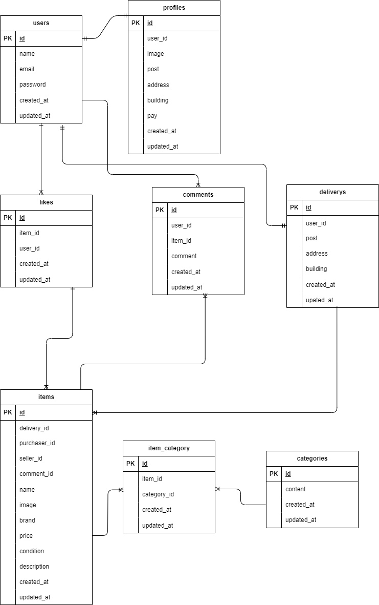

# COACHTECHフリマ

## 環境構築
**Dockerビルド**
1. `git clone git@github.com:daiki-hayakawa/frima.git
2. DockerDesktopアプリを立ち上げる
3. `docker-compose up -d --build`

**Larevel環境構築**
1. `docker-compose exec php bash`
2. `composer install`
3. 「.env.example」ファイルをコピーして「.env」ファイルを作成
4. .envに以下の環境変数を追加
``` text
DB_CONNECTION=mysql
DB_HOST=mysql
DB_PORT=3306
DB_DATABASE=laravel_db
DB_USERNAME=laravel_user
DB_PASSWORD=laravel_pass
```

5. アプリケーションキーの作成
``` bash
php artisan key:generate
```

6. マイグレーションの実行
``` bash
php artisan migrate
```

7. シーディングの実行
``` bash
php artisan db:seed
```

8. シンボリックリンク作成
``` bash
php artisan storage:link
```

## 使用技術（実行環境）
- PHP7.4.9
- Laravel8.83.8
- MySQL8.0.26

## テーブル設計

## ER図


## URL
- 開発環境：http://localhost/
- phpMyAdmin：http://localhost:8080/
